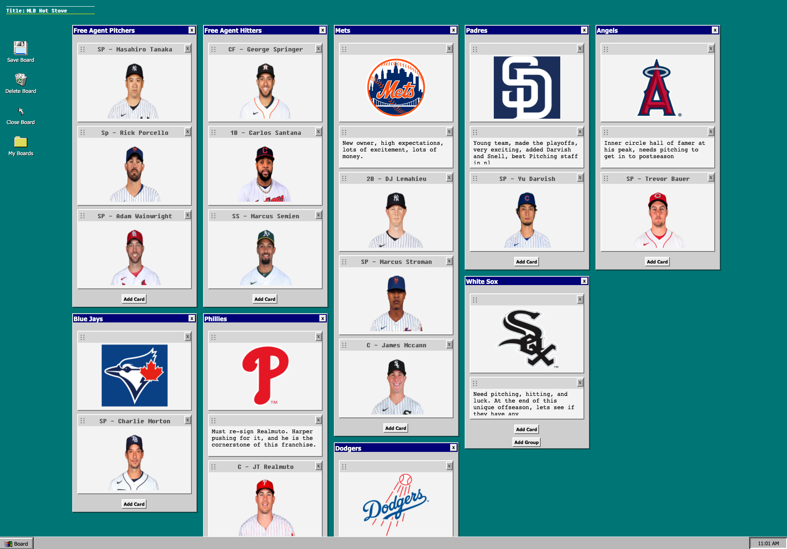
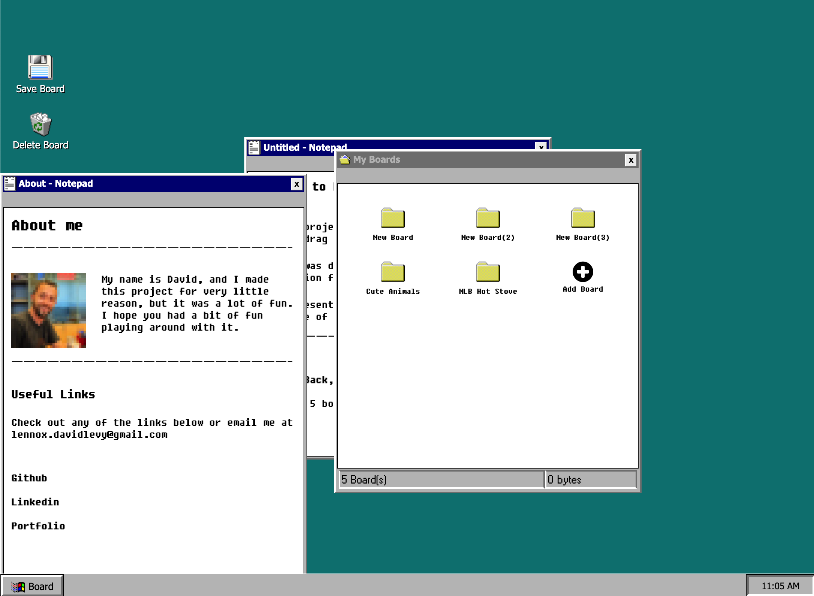
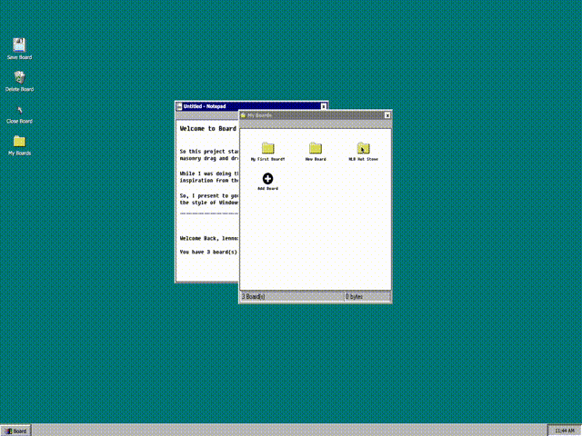

# Kanban/board via Windows 95



This started as a project to create a Kanban board in React, but rendered with masonry a la Pinterest. While I was building it, I decided to try to style it in, and then give it some very basic functionality of the Windows 95 OS.



You can check it out at [Kanban a la Win95](https://blooming-dawn-47621.herokuapp.com/)



## Production

Made using React

You can download the application and run it locally:

```
$ git clone https://github.com/lennox-davidlevy/dragdrop.git
$ cd dragdrop
$ npm install
```

Find /config/default\_(temp).json and change the values to your MongoURI (either from atlas, or locally) and your JWT secret (it can be anything, just make sure not to push to git until you change the name of the file, as its already in .gitignore)

## Planned Implementations

I plan on adding these features soon:

- Public, sharable boards
- add website link preview to the cards
- add video link capability to the cards
